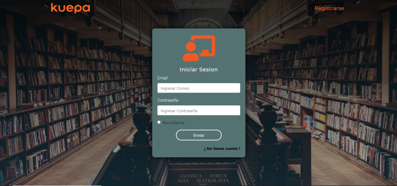

# Chat_Kuepa

## Inicio del proyecto
El proyecto está realizado con una base de datos en postgres, por lo que es necesario contar con credenciales para que pueda operar correctamente. Clona este repositorio en una carpeta de preferencia en tu computador. Luego, en una terminal accede a la carpeta api dentro de la carpeta deseada y ejecuta el siguiente comando.

    npm install
        

Accede luego a la carpeta client dentro de la carpeta deseada y ejecuta el mismo comando.

    npm install

posteriormente, dentro de la carpeta api, crea un archivo denominado .env y dentro de este deberás colocar los siguientes datos:
    
    DB_USER=tu-usuario-postgres
    DB_PASSWORD=tu-contraseña-postgres
    DB_HOST=localhost:puerto-postgres

Ahora, accediendo a ambas carpetas (api y client) en 2 terminales diferentes, ejecuta el siguiente comando en cada una:

    npm start

## Descripción

Una vez inciado el proyecto la aplicación te permitirá registrar usuarios y loguearte para disfrutar de tu clase Kuepa!. Sientete libre de inciar sesión con diferentes usuarios para comprobar el funcionamiento del chat.

## Tecnologías implementadas

## client

* Javascript
* React (componentes funcionales)
* React hooks
* React bootstrap
* Redux-thunk
* socket-io (tiempo real)

## api

* Node Js
* Express Js
* Sequelize ORM (postgreSQL)
* Passport (autenticación)
* socket-io (tiempo real)